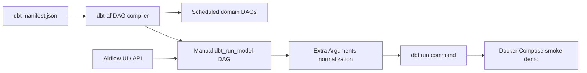

# dbt-af: надежный manual rerun DAG

## Статус

Этот репозиторий — fork `Toloka/dbt-af`. Добавленный слой не претендует на ownership исходного проекта; он фиксирует конкретный reliability scenario вокруг ручного запуска dbt-модели через Airflow.

Текущий слой состоит из двух частей:

- manual `<dbt_project_name>_dbt_run_model` Airflow DAG стал устойчивым к empty/default/null Extra Arguments;
- локальный Docker Compose example стал воспроизводимым orchestration smoke demo для Airflow/dbt path.

## Проблема

`dbt-af` умеет генерировать manual DAG `<dbt_project_name>_dbt_run_model`. Data engineers используют его, чтобы rerun-ить одну модель, backfill-ить конкретный interval или проверить новую модель без ожидания regular schedule.

Manual trigger form содержит поле **Extra Arguments** для optional dbt CLI flags. На практике пользователи часто оставляют поле без изменений, очищают его до `{}` или отправляют `null` через Airflow UI/API. Такой path должен означать “no extra options”, а реальные custom dbt options должны продолжать проходить в command.

## Добавленный reliability layer

- Исправлен `build_dbt_run_model_bash_extra_options`: `None`, `{}` и default placeholder игнорируются.
- Сохранена поддержка custom options вроде `{"profiles-dir": "/tmp/profiles", "--option": "custom-value"}`.
- Добавлено regression coverage для empty/default input и custom dbt CLI options.
- Manual DAG behavior задокументирован в main configuration docs и basic project example.
- Docker Compose demo bootstrap доведен до Airflow database migration и pool creation.
- Добавлен local smoke script: он builds dbt manifest, starts Airflow, checks DAG discovery и проверяет manual `dbt_af_project_dbt_run_model` task list.

## Architecture Slice



Слой намеренно узкий: upstream DAG-generation model не переписывается. Исправлен manual rerun path, который data engineers используют для one-off model validation, backfills и debugging.

## Demo scenario

1. Открыть generated `<dbt_project_name>_dbt_run_model` DAG в Airflow.
2. Заполнить `Model Selector`, `Interval Start Datetime` и `Interval End Datetime`.
3. Оставить **Extra Arguments** без изменений, очистить до `{}` или отправить как `null`.
4. Trigger the DAG.
5. Expected behavior: dbt command собирается без extra CLI options и не падает при обработке empty optional arguments.
6. Добавлять custom JSON только когда нужны реальные dbt options:

```json
{
  "profiles-dir": "/tmp/profiles",
  "--option": "custom-value"
}
```

Expected command behavior: оба key нормализуются в dbt CLI options, включая missing `--` prefix для `profiles-dir`.

## Validation

Focused local check:

```bash
poetry run pytest -q tests/test_common_utils.py
```

Docker Compose demo check:

```bash
docker compose -f examples/docker-compose.yaml config --quiet
cd examples && ./smoke_orchestration.sh
```

Full project check used by CI:

```bash
poetry run pytest -q -s -vv --log-cli-level=INFO --cov=dbt_af --cov-report=term --run-airflow-tasks tests
ruff check
```

## Роль проекта

Этот fork ограничен manual `dbt_run_model` reliability path и локальным Airflow/dbt orchestration smoke demo. Он не претендует на ownership исходного `Toloka/dbt-af`; ценность слоя в проверяемом исправлении, regression tests и runnable local evidence.
