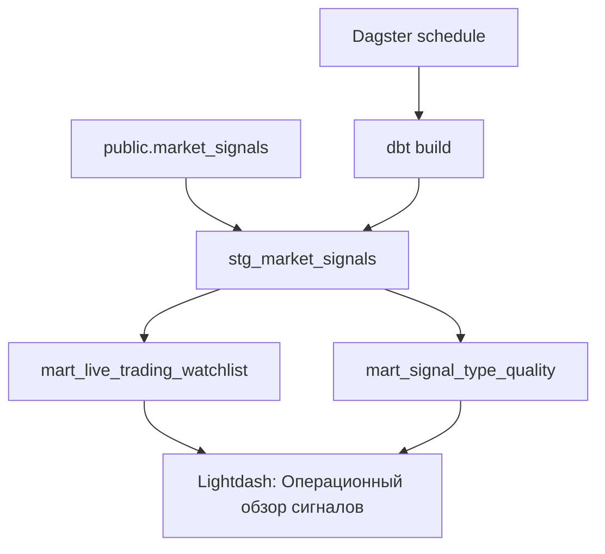

# Investment Signals Analytics: от событий к операционному решению

## Задача

`investment-signals` генерирует live-сигналы по рынку, но для эксплуатации важно не только увидеть факт сигнала.
Нужно понимать:

- какие сигналы достаточно качественные для ручного разбора;
- какие сигналы действительно доставляются в канал уведомлений;
- где правила доставки блокируют сильные события;
- какие типы сигналов стоит развивать, а какие создают шум.

Этот репозиторий закрывает аналитический контур вокруг этих вопросов: берет live-данные из Postgres, пересчитывает dbt-витрины,
обновляет их через Dagster и публикует Lightdash-панель для ежедневного контроля.

## Почему это отдельный контур

Аналитика сигналов не должна жить внутри production-сервиса уведомлений. У нее другой жизненный цикл:

- можно безопасно менять правила scoring и витрины без риска сломать ingestion;
- можно запускать пересчет вручную или по расписанию;
- можно версионировать dbt-модели и Lightdash dashboard как код;
- можно отделить operational API от аналитических таблиц и BI-интерфейса.

## Data flow



## Витрины

### `stg_market_signals`

Нормализует live-события:

- приводит payload к аналитическим колонкам;
- выделяет `quality_score`, `delivery_status`, `delivery_reason`;
- сохраняет исходные признаки сигнала: тикер, тип, серьезность, z-score, окно наблюдения.

### `mart_live_trading_watchlist`

Формирует рабочий список сигналов:

- считает `decision_score`;
- присваивает итоговое решение: `кандидат`, `наблюдать`, `пропустить`, `заблокировать_политикой`;
- объясняет причину решения в `decision_reason`;
- показывает, какие события стоит разобрать вручную.

### `mart_signal_type_quality`

Агрегирует качество типов сигналов по тикеру:

- число сигналов;
- доставленные и ограниченные события;
- среднее качество;
- средний модуль z-score;
- статус применимости типа сигнала.

## Что показывает дашборд

Главный текущий вывод из локального стенда: доставка является главным ограничением. В данных есть сильные сигналы, но большая
часть из них не попадает в уведомления из-за политики доставки.

Дашборд отвечает на четыре вопроса:

1. Сколько сигналов обнаружено, доставлено и попало в кандидаты.
2. Как система распределяет решения после scoring.
3. Какие типы сигналов выглядят надежнее остальных.
4. Какие сильные сигналы блокируются правилами доставки.


## Эксплуатационные решения

По этому дашборду можно принимать конкретные решения:

- ослабить или уточнить delivery cooldown для сильных `volume_spike`;
- вынести `trade_rate_spike` в отдельный канал ручной проверки;
- оставить `spread_widening` как наблюдаемый сигнал до улучшения качества;
- смотреть не только число сигналов, но и долю доставленных событий.

## Проверка

Локальный smoke path:

```bash
docker compose run --rm dbt
docker compose up -d dagster
docker compose --profile lightdash up -d lightdash
docker compose --profile lightdash --profile deploy run --rm lightdash-deploy
```

Ожидаемый результат:

- dbt проходит source/model tests;
- Dagster показывает job `investment_signals_refresh_job`;
- Lightdash открывает dashboard `Операционный обзор сигналов`;
- dashboard показывает ключевые показатели, распределение решений, узкие места доставки и детальные таблицы.
