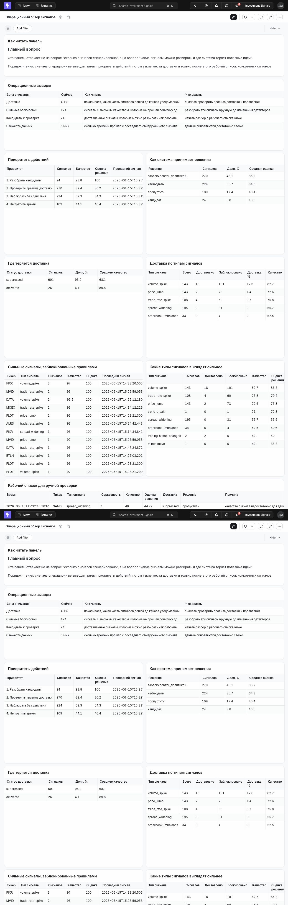
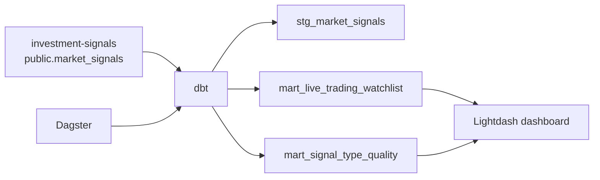
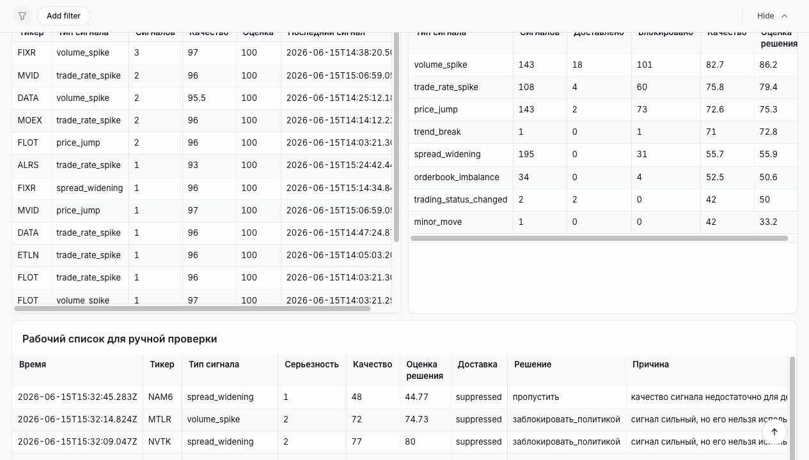

# dbt-af: аналитика live-сигналов

`dbt-af` собирает аналитический контур вокруг сервиса
[`investment-signals`](https://github.com/karnaksp/investment-signals).

Проект берет live-сигналы из Postgres, строит dbt-витрины, обновляет их через Dagster и показывает готовый
Lightdash-дашборд для разбора качества сигналов, доставки и ручных действий.



## Зачем это нужно

`investment-signals` генерирует рыночные сигналы. Этого мало: нужно понимать, какие из них дошли до уведомлений,
какие заблокированы правилами доставки, где есть шум и что стоит разобрать вручную.

Этот репозиторий отвечает на четыре практических вопроса:

- какие сигналы можно проверять прямо сейчас;
- какие сильные сигналы не дошли до уведомлений;
- какие типы сигналов стабильнее остальных;
- где нужно менять правила доставки, а не сами детекторы.

## Что запускается



Основные части:

- `analytics/investment_signals_dbt` - dbt-проект с витринами и тестами.
- `analytics/dagster` - job и расписание пересчета витрин.
- `analytics/investment_signals_dbt/lightdash` - дашборд, SQL-чарты и пространство Lightdash как код.
- `docker-compose.yml` - локальный запуск dbt, Dagster, Lightdash, Postgres Lightdash и MinIO.

## Быстрый запуск

Сначала поднимите `investment-signals`, чтобы его Postgres был доступен на порту `35432`.

```bash
cp .env.example .env
docker compose run --rm dbt
docker compose up -d dagster
docker compose --profile lightdash up -d lightdash
```

Интерфейсы:

- Dagster: [http://localhost:13000](http://localhost:13000)
- Lightdash: [http://localhost:18083](http://localhost:18083)
- MinIO: [http://localhost:19001](http://localhost:19001)

## Дашборд

Дашборд `Операционный обзор сигналов` показывает:

- операционный вывод: что сейчас ограничивает полезность сигналов;
- приоритеты действий: разобрать кандидатов, проверить правила доставки, наблюдать или пропустить;
- воронку доставки;
- качество типов сигналов;
- сильные сигналы, заблокированные политикой доставки;
- рабочий список для ручной проверки.



## Команды

```bash
make dbt-build          # пересчитать dbt-витрины
make dagster-up         # поднять Dagster
make lightdash-up       # поднять Lightdash
make lightdash-validate # проверить Lightdash dashboard-as-code
make qa                 # compose + dbt tests + Lightdash validation + healthcheck
```

## Загрузка дашборда в Lightdash

После первого входа в Lightdash создайте Personal Access Token и заполните `.env`:

```dotenv
LIGHTDASH_API_KEY=...
LIGHTDASH_PROJECT=...
```

Затем выполните:

```bash
docker compose --profile lightdash --profile deploy run --rm lightdash-deploy
```

Команда выполнит `dbt build`, загрузит проект в Lightdash и применит dashboard-as-code.

## Проверки качества

В репозитории есть:

- dbt tests для источника, staging-слоя и витрин;
- GitHub Actions workflow `Analytics stack`;
- валидатор Lightdash YAML: `scripts/validate_lightdash_assets.py`;
- `.env.example` без секретов;
- healthcheck для Lightdash;
- скриншоты готового продукта.

Локально проверено:

```bash
make qa
```

## Где смотреть код

- dbt-модели: `analytics/investment_signals_dbt/models`
- Dagster: `analytics/dagster/definitions.py`
- Lightdash-чарты: `analytics/investment_signals_dbt/lightdash/charts`
- Lightdash-дашборд: `analytics/investment_signals_dbt/lightdash/dashboards/investment-signals-operations.yml`
- подробное описание решения: [CASE_STUDY.md](CASE_STUDY.md)
